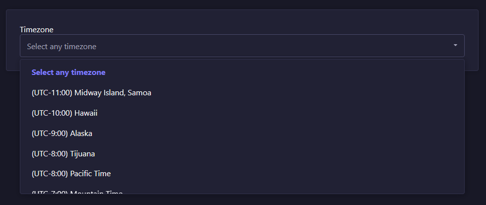

# Strapi plugin Startbit Timezone Select

The official plugin to provide custom select field into admin

Plugin Name: Startbit Timezone Select

Description: Startbit Timezone Select is a Strapi plugin that adds a custom Timezone field, allowing users to select and display time zones listing in UTC format.

## Features
1. Display timezones list of all countries.
2. List the timezones in the UTC format that is useful to identify.
3. Used the strapi SingleSelect component.

## Installation
To install this plugin, you need to add an NPM dependency to your Strapi application.

```sh
# Using Yarn
yarn add @strapi/plugin-startbit-timezone-select
# Or using NPM
npm install @strapi/plugin-startbit-timezone-select
```

## Dependency
Run the below command into terminal to install the pear package of plugin on root

```sh
npm install react-timezone-select
# or
yarn add react-timezone-select
```

## Configuration
Go to `./config/plugins.js` and enable the plugin

**Example**

```js
module.exports = () => ({
    'startbit-timezone-select': {
    enabled: true,
    resolve: './src/plugins/startbit-timezone-select'
  },
});
```

Then, you'll need to build your admin panel:

```js
# Using Yarn
yarn build

# Or using NPM
npm run build
```

## Disabling altogether
Like every other plugin, you can also disable this plugin in the plugins configuration file.
Go to ./config/plugins.js and switch enabled to false

**Example**

```js
module.exports = () => ({
    'startbit-timezone-select': {
    enabled: false,
    resolve: './src/plugins/startbit-timezone-select'
  },
});
```

## Usage

After installation you will find the timezone-select at the custom field section of the content-type builder.


Now you can select any country from the list. The Alpha-2 code of the selected timezone is stored in the database.



